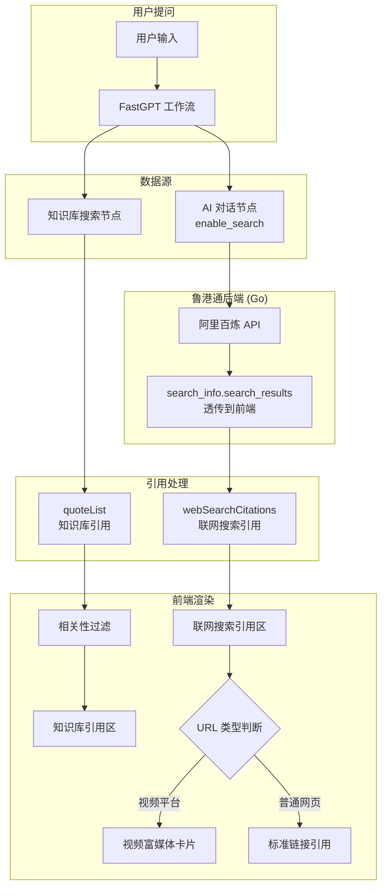

# Design Document: 引用系统优化

## Overview

鲁港通引用系统存在三个核心问题需要解决：

1. **知识库引用不相关**：知识库搜索返回的结果与用户问题不匹配，但仍然展示给用户（如问签证问题却显示公司注册处文档）
2. **联网搜索来源缺失**：模型通过阿里百炼 `enable_search` 联网搜索后，搜索来源 URL 未传递到前端，用户只能看到知识库引用
3. **视频引用缺少富媒体**：社交媒体视频链接没有预览图和标题，用户体验不如阿里千问

本设计分三个模块解决这些问题，优先级从高到低。

## Architecture



## Components and Interfaces

### 1. 知识库引用相关性过滤

**问题根因**：当前 `ResponseTags` 组件按 `collectionId` 去重后直接展示所有知识库搜索结果，没有根据相关性分数过滤。知识库搜索节点虽然有 `similarity` 参数，但该参数控制的是搜索阶段的过滤，而非展示阶段。当工作流配置的阈值较低或未配置时，低相关性结果也会被展示。

**解决方案**：在前端 `ResponseTags` 组件中，根据每个 `quoteItem` 的 `score` 字段进行二次过滤。

```typescript
// 在 ResponseTags.tsx 的 citationRenderList 计算中
// 过滤低相关性引用（普通用户）
const CITATION_RELEVANCE_THRESHOLD = 0.4; // 默认阈值

const filteredQuoteItems = isRoot 
  ? uniqueQuoteItems  // 管理员看全部
  : uniqueQuoteItems.filter(item => {
      // 取最高分数作为相关性判断
      const maxScore = Math.max(
        ...item.score.map(s => s.value || 0)
      );
      return maxScore >= CITATION_RELEVANCE_THRESHOLD;
    });
```

**阈值配置**：通过系统配置 `feConfigs.citationRelevanceThreshold` 允许管理员调整，默认 0.4。

### 2. 联网搜索来源透传

**问题根因**：阿里百炼 API 在 `enable_search=true` 时，响应中包含 `search_info.search_results` 字段（含 `title`、`url`、`icon`、`site_name`）。但当前链路存在两个断点：

1. **鲁港通后端（Go）**：兼容模式下非流式响应直接透传 JSON（`io.Copy`），`search_info` 保留。但流式响应中，`StreamHandler` 只解析 `ChatCompletionsStreamResponse` 结构体，不包含 `search_info` 字段，导致流式模式下搜索结果丢失。
2. **鲁港通前端（FastGPT）**：`createLLMResponse` 函数只提取 `answerText`、`reasoningText`、`toolCalls`、`usage`，完全忽略了 `search_info`。

**解决方案**：

#### 2a. 后端：流式响应透传 search_info

阿里百炼在 OpenAI 兼容模式的流式响应中，会在某个 chunk 中返回 `search_info`。需要修改 `openai.StreamHandler` 或在阿里适配器中特殊处理，将包含 `search_info` 的 chunk 透传给前端。

实际上，当前 `StreamHandler` 已经对无法解析的数据执行 `render.StringData(c, data)`（即透传），所以如果阿里百炼在流式 chunk 中返回 `search_info`，它会被透传。但需要确认阿里百炼兼容模式的流式响应格式。

根据阿里百炼文档，OpenAI 兼容模式的流式响应中，`search_info` 不在标准 SSE chunk 中返回。需要使用 `search_options.enable_source: true` 和 `search_options.prepend_search_result: true` 参数，让搜索结果在第一个 chunk 中提前返回。

但 OpenAI 兼容模式不支持 `prepend_search_result`，只有 DashScope 原生模式支持。因此需要在后端做特殊处理：

**方案 A（推荐）**：在 `ConvertCompatRequest` 中添加 `search_options`，启用 `enable_source: true`。阿里百炼兼容模式会在非流式响应的 JSON 中返回 `search_info`，在流式响应的最后一个 chunk 或单独的 chunk 中返回。后端 `StreamHandler` 的 `render.StringData(c, data)` 会透传这些数据。

**方案 B**：前端从 AI 回答文本中解析 `[ref_N]` 角标，结合非流式请求获取 `search_info`。

选择方案 A，因为它更干净。

#### 2b. 前端：解析 search_info 并渲染

在 `createLLMResponse` 或 `dispatchChatCompletion` 中捕获 `search_info`，传递到 `responseData`，最终在 `ResponseTags` 中渲染。

```typescript
// 新增类型定义
export type WebSearchCitation = {
  index: number;
  title: string;
  url: string;
  icon?: string;
  siteName?: string;
};

// 在 ChatHistoryItemResType 中新增
export type ChatHistoryItemResType = {
  // ... 现有字段
  webSearchCitations?: WebSearchCitation[];
};
```

### 3. 视频引用富媒体展示

**解决方案**：在前端识别视频平台 URL，使用平台特定的缩略图 API 获取预览图。

```typescript
// 视频平台识别和缩略图获取
const VIDEO_PLATFORMS = {
  youtube: {
    pattern: /(?:youtube\.com\/watch\?v=|youtu\.be\/)([a-zA-Z0-9_-]+)/,
    getThumbnail: (videoId: string) => `https://img.youtube.com/vi/${videoId}/mqdefault.jpg`
  },
  bilibili: {
    pattern: /bilibili\.com\/video\/(BV[a-zA-Z0-9]+)/,
    getThumbnail: null // 需要 API 调用，降级为平台图标
  },
  douyin: {
    pattern: /douyin\.com\/video\/(\d+)/,
    getThumbnail: null // 需要 API 调用，降级为平台图标
  },
  xiaohongshu: {
    pattern: /xiaohongshu\.com\/(?:explore|discovery\/item)\/([a-zA-Z0-9]+)/,
    getThumbnail: null
  }
};
```

对于 YouTube，可以直接通过 URL 构造缩略图地址。对于其他平台，降级为平台 logo 图标 + 标题。

### 4. 引用分组展示

当同时存在知识库引用和联网搜索引用时，分组展示：

```
📚 引用（知识库）
  1. 相关文档A
  2. 相关文档B

🌐 引用（联网搜索）
  3. [新浪网] 相关新闻标题
  4. [YouTube ▶️] 视频标题  [缩略图]
```

## Data Models

### WebSearchCitation 类型

```typescript
// packages/global/core/chat/type.d.ts
export type WebSearchCitation = {
  index: number;
  title: string;
  url: string;
  icon?: string;       // 网站 favicon
  siteName?: string;   // 网站名称
  thumbnail?: string;  // 视频缩略图 URL（仅视频类型）
  isVideo?: boolean;   // 是否为视频引用
};
```

### 扩展 ChatHistoryItemResType

```typescript
// 在现有类型基础上扩展
export type ChatHistoryItemResType = {
  // ... 现有字段
  webSearchCitations?: WebSearchCitation[];
};
```

### 扩展 ChatItemType

```typescript
export type ChatItemType = {
  // ... 现有字段
  webSearchCitations?: WebSearchCitation[];
};
```

### 后端 Go 类型扩展

```go
// relay/adaptor/ali/model.go
type AliSearchOptions struct {
    ForcedSearch   bool   `json:"forced_search,omitempty"`
    SearchStrategy string `json:"search_strategy,omitempty"`
    EnableSource   bool   `json:"enable_source,omitempty"`   // 新增
    EnableCitation bool   `json:"enable_citation,omitempty"` // 新增
}
```


## Correctness Properties

*A property is a characteristic or behavior that should hold true across all valid executions of a system — essentially, a formal statement about what the system should do. Properties serve as the bridge between human-readable specifications and machine-verifiable correctness guarantees.*

### Property 1: 知识库引用相关性过滤

*For any* list of knowledge base search results with scores, and any relevance threshold:
- When the user is a normal user, only results with max score >= threshold should appear in the citation list
- When the user is an admin, all results should appear regardless of score

**Validates: Requirements 1.1, 1.2, 1.5**

### Property 2: 联网搜索结果解析

*For any* valid `search_info.search_results` array from the Alibaba API response, parsing should produce `WebSearchCitation` objects where each object's `title` and `url` match the corresponding fields in the source data, and the array length is preserved.

**Validates: Requirements 2.1, 2.6, 4.3**

### Property 3: 视频平台识别与缩略图生成

*For any* URL matching a known video platform pattern (YouTube, Bilibili, Douyin, Xiaohongshu), the system should:
- Correctly identify it as a video citation (`isVideo === true`)
- For YouTube URLs, generate a valid thumbnail URL containing the video ID
- For other platforms, return the platform's default icon as fallback

**Validates: Requirements 3.1, 3.5**

### Property 4: 引用分组正确性

*For any* mixed list of knowledge base citations and web search citations, the rendered citation list should:
- Place all knowledge base citations before web search citations (or in separate groups)
- Preserve the total count: `knowledgeBaseCitations.length + webSearchCitations.length === totalCitations.length`
- Each citation should retain its original type designation

**Validates: Requirements 2.4, 2.5**

## Error Handling

### 知识库引用
- 如果 `score` 字段缺失或为空数组，视为分数为 0，被过滤掉（普通用户）
- 如果阈值配置无效（非数字或超出 0-1 范围），使用默认值 0.4

### 联网搜索引用
- 如果 `search_info` 字段不存在或格式错误，静默忽略，不显示联网搜索引用
- 如果 `search_results` 中某项缺少 `url`，跳过该项
- 如果后端透传失败，前端降级为不显示联网搜索引用

### 视频引用
- 如果视频缩略图加载失败（如 YouTube 缩略图 404），显示平台默认图标
- 如果 URL 无法匹配任何已知视频平台，按普通链接处理
- OG Metadata 获取超时（>3s），使用降级展示

## Testing Strategy

### 属性测试（Property-Based Testing）

使用 `fast-check` 库，每个属性测试运行最少 100 次迭代。

- **Property 1 测试**：生成随机 `SearchDataResponseItemType[]` 数组（含随机 score）和随机阈值，验证过滤逻辑
- **Property 2 测试**：生成随机 `search_results` 数组，验证解析结果的字段映射
- **Property 3 测试**：生成随机视频平台 URL，验证识别和缩略图生成
- **Property 4 测试**：生成随机混合引用列表，验证分组逻辑

### 单元测试

- 测试 `CITATION_RELEVANCE_THRESHOLD` 默认值和配置覆盖
- 测试空 `search_info` 和空 `search_results` 的边界情况
- 测试各视频平台 URL 的正则匹配
- 测试 YouTube 缩略图 URL 构造

### 集成测试

- 测试后端 Go 代码中 `search_options.enable_source` 参数的添加
- 测试流式和非流式模式下 `search_info` 的透传
