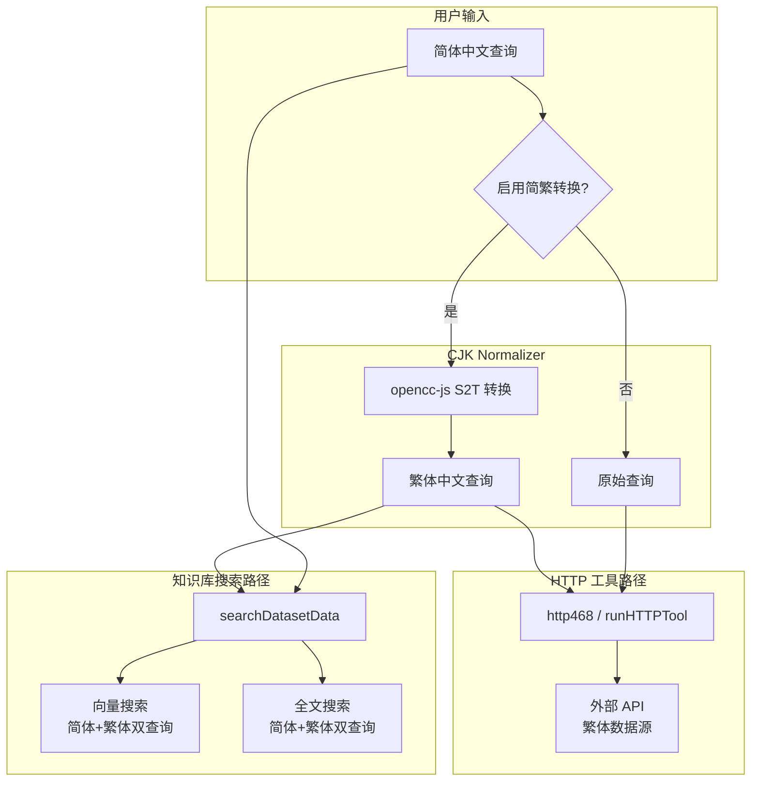

# Design Document: 中文简繁搜索规范化

## Overview

鲁港通平台服务大陆和香港用户，但外部 API 数据源（如香港学校数据库）和知识库内容多为繁体中文。当大陆用户输入简体中文搜索时，由于缺乏简繁转换，导致搜索失败或返回不相关结果。

本设计引入 `opencc-js` 库实现简繁中文转换，在两个关键位置集成：
1. **HTTP 工具请求**：在 `http468.ts` 和 `http.ts`（runHTTPTool）发送请求前，对参数进行简繁转换
2. **知识库搜索**：在 `search/controller.ts` 的查询阶段，生成繁体版本查询以提高召回率

转换通过配置开关控制，默认关闭，避免影响不需要转换的场景。

## Architecture



## Components and Interfaces

### 1. CJK Normalizer 模块

创建 `packages/service/common/string/cjkNormalizer.ts`，封装 `opencc-js` 的简繁转换功能。

```typescript
// packages/service/common/string/cjkNormalizer.ts
import * as OpenCC from 'opencc-js';

// 简体 → 繁体转换器（启动时初始化，常驻内存）
const s2tConverter = OpenCC.Converter({ from: 'cn', to: 'tw' });
// 繁体 → 简体转换器
const t2sConverter = OpenCC.Converter({ from: 'tw', to: 'cn' });

/**
 * 鲁港通 - 简体中文转繁体中文
 */
export function simplifiedToTraditional(text: string): string {
  if (!text) return text;
  return s2tConverter(text);
}

/**
 * 鲁港通 - 繁体中文转简体中文
 */
export function traditionalToSimplified(text: string): string {
  if (!text) return text;
  return t2sConverter(text);
}

/**
 * 鲁港通 - 检测文本是否包含中文字符
 */
export function containsChinese(text: string): boolean {
  return /[\u4e00-\u9fff]/.test(text);
}

/**
 * 鲁港通 - 对对象中所有字符串值执行简繁转换
 * 递归处理嵌套对象和数组
 */
export function convertParamsS2T(params: Record<string, any>): Record<string, any> {
  const result: Record<string, any> = {};
  for (const [key, value] of Object.entries(params)) {
    if (typeof value === 'string' && containsChinese(value)) {
      result[key] = simplifiedToTraditional(value);
    } else if (Array.isArray(value)) {
      result[key] = value.map(item =>
        typeof item === 'string' && containsChinese(item)
          ? simplifiedToTraditional(item)
          : typeof item === 'object' && item !== null
            ? convertParamsS2T(item)
            : item
      );
    } else if (typeof value === 'object' && value !== null) {
      result[key] = convertParamsS2T(value);
    } else {
      result[key] = value;
    }
  }
  return result;
}
```

### 2. HTTP 工具集成（http468.ts）

在 `dispatchHttp468Request` 中，检查工作流变量 `__enableS2T__`，如果启用则对请求参数和 body 执行简繁转换。

```typescript
// 在 dispatchHttp468Request 中，构建 requestBody 之前
const enableS2T = variables?.__enableS2T__ === true || variables?.__enableS2T__ === 'true';

if (enableS2T) {
  // 转换 URL 中的中文参数
  httpReqUrl = simplifiedToTraditional(httpReqUrl);
  // 转换 query params
  // 转换 body 中的字符串值
}
```

### 3. HTTP Tool Runner 集成（http.ts - runHTTPTool）

在 `runHTTPTool` 中，通过新增可选参数 `enableS2T` 控制是否对 params 执行简繁转换。调用方（`runTool.ts`）从工作流变量中读取 `__enableS2T__` 并传入。

```typescript
// RunHTTPToolParams 新增
export type RunHTTPToolParams = {
  // ... 现有字段
  enableS2T?: boolean; // 是否启用简繁转换
};

// buildHttpRequest 中，对 params 和 body 执行转换
if (enableS2T) {
  params = convertParamsS2T(params);
}
```

### 4. 知识库搜索集成

在 `searchDatasetData` 中，当 `enableCjkNormalization` 配置启用时，对查询生成繁体版本，与原始查询一起进行搜索。

```typescript
// 在 searchDatasetData 的 queries 处理阶段
if (enableCjkNormalization) {
  const traditionalQueries = queries.map(q => simplifiedToTraditional(q));
  // 合并原始查询和繁体查询，去重
  queries = [...new Set([...queries, ...traditionalQueries])];
  // reRankQuery 也生成繁体版本
  reRankQuery = simplifiedToTraditional(reRankQuery);
}
```

### 5. 配置项

通过 `feConfigs` 系统配置控制知识库搜索的简繁兼容：

```typescript
// packages/global/common/system/types/index.d.ts
export type FeConfigsType = {
  // ... 现有字段
  enableCjkNormalization?: boolean; // 启用知识库搜索简繁兼容
};
```

HTTP 工具的简繁转换通过工作流变量 `__enableS2T__` 控制，不需要全局配置。

## Data Models

### 新增依赖

```json
// packages/service/package.json
{
  "dependencies": {
    "opencc-js": "^1.0.5"
  }
}
```

### 工作流变量

| 变量名 | 类型 | 默认值 | 说明 |
|--------|------|--------|------|
| `__enableS2T__` | boolean | false | HTTP 工具请求参数简繁转换开关 |

### 系统配置

| 配置项 | 类型 | 默认值 | 说明 |
|--------|------|--------|------|
| `feConfigs.enableCjkNormalization` | boolean | false | 知识库搜索简繁兼容开关 |

## Correctness Properties

*A property is a characteristic or behavior that should hold true across all valid executions of a system — essentially, a formal statement about what the system should do. Properties serve as the bridge between human-readable specifications and machine-verifiable correctness guarantees.*

### Property 1: 简繁转换 round-trip

*For any* valid simplified Chinese string, converting it to traditional Chinese and then back to simplified Chinese SHALL produce a string equivalent to the original input.

This is a round-trip property validating the core conversion logic. Note: due to one-to-many mappings in Chinese (e.g. "发" → "發"/"髮"), we test with common characters where the round-trip is expected to hold.

**Validates: Requirements 2.4**

### Property 2: 非中文字符保留

*For any* string composed entirely of non-Chinese characters (ASCII letters, digits, punctuation, whitespace), applying S2T conversion SHALL produce an identical string.

This is an invariant property — the converter should be a no-op on non-Chinese text.

**Validates: Requirements 2.3**

### Property 3: 递归参数转换完整性

*For any* nested object (Record<string, any>) containing string values with Chinese characters, applying `convertParamsS2T` SHALL convert all Chinese string values while preserving the object structure (same keys, same nesting depth, same non-string values).

This is a metamorphic property: the structure is preserved, only Chinese string values change.

**Validates: Requirements 1.1, 1.3**

### Property 4: 启用/禁用开关控制

*For any* set of request parameters, when `__enableS2T__` is false or undefined, the HTTP tool SHALL send parameters identical to the original input (no conversion applied). When `__enableS2T__` is true, parameters containing simplified Chinese SHALL differ from the original.

This is an invariant property for the disabled case and a metamorphic property for the enabled case.

**Validates: Requirements 1.4, 1.5**

### Property 5: 知识库查询扩展

*For any* simplified Chinese query string, when `enableCjkNormalization` is true, the expanded query set SHALL contain at least the original query and its traditional Chinese equivalent. The expanded set size SHALL be greater than or equal to the original set size.

This is a metamorphic property: enabling CJK normalization can only add queries, never remove them.

**Validates: Requirements 3.1, 3.2, 3.4**

## Error Handling

### 转换错误
- 如果 `opencc-js` 转换抛出异常，静默捕获并使用原始未转换的文本
- 转换失败不应阻断请求流程

### 空值处理
- 空字符串、null、undefined 输入直接返回原值，不执行转换
- 对象中的非字符串值（数字、布尔值）保持不变

### 配置缺失
- `__enableS2T__` 未设置时默认为 false（不转换）
- `enableCjkNormalization` 未设置时默认为 false（不扩展查询）

### 性能保护
- `opencc-js` 使用内存映射表，无 I/O 操作，转换延迟可忽略
- 知识库查询扩展最多将查询数量翻倍，不会导致指数增长

## Testing Strategy

### 属性测试（Property-Based Testing）

使用 `fast-check` 库，每个属性测试运行最少 100 次迭代。

- **Property 1 测试**：生成随机简体中文字符串（从常见简体字集合中采样），执行 S→T→S 转换，验证结果等于原始输入
- **Property 2 测试**：生成随机 ASCII 字符串，执行 S2T 转换，验证输出等于输入
- **Property 3 测试**：生成随机嵌套对象（含中文和非中文字符串值），执行 `convertParamsS2T`，验证结构保持不变且所有中文字符串被转换
- **Property 4 测试**：生成随机参数对象，分别在 `__enableS2T__` 为 true 和 false 时执行，验证 false 时输出等于输入
- **Property 5 测试**：生成随机简体中文查询列表，启用 CJK normalization 后验证扩展后的查询集包含原始查询和繁体版本

### 单元测试

- 测试已知简繁对照字符（学→學、国→國、门→門、车→車、培侨→培僑）
- 测试混合文本（中英混合、中文+数字）
- 测试空输入和边界情况
- 测试 `convertParamsS2T` 对嵌套对象的递归处理

### PBT 库选择

使用 `fast-check`（项目已有依赖），配置每个属性测试最少 100 次迭代。

每个属性测试标注格式：`Feature: cjk-search-normalization, Property {number}: {property_text}`

