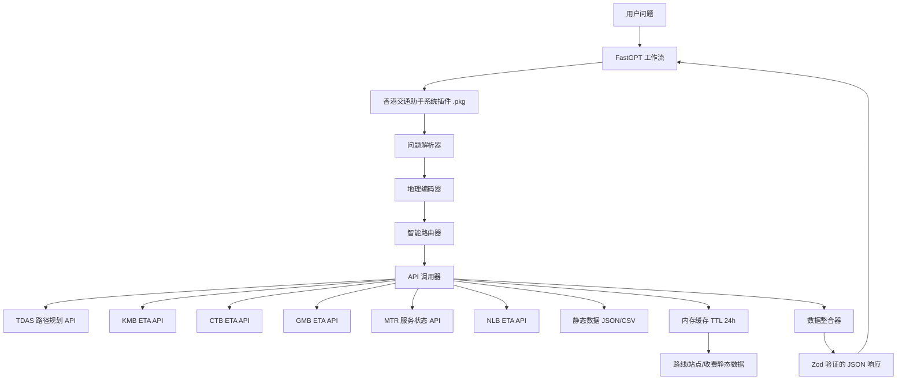

# 设计文档：香港智能交通助手

## Overview

香港智能交通助手是一个 Cloudflare Worker（HTTP 工具），功能对标港话通 App 的交通路线查询模块。系统接收用户的自然语言交通问题，调用香港政府公开交通 API，返回路线方案、实时到站时间、费用和出行建议。

### 核心功能（对标港话通截图）

1. **路线规划**：显示多条路线方案（如"48分钟 路线1"），含换乘步骤、步行距离
2. **巴士站 ETA**：按站点显示所有经过该站的路线实时到站时间
3. **路线筛选**：可按路线号（如"215X"）过滤显示特定路线的 ETA
4. **刷新数据**：支持手动刷新获取最新实时数据

### 技术选型

- **开发框架**：fastgpt-plugin（FastGPT 官方插件项目）
- **运行环境**：Bun
- **开发语言**：TypeScript
- **类型验证**：Zod
- **RPC 框架**：ts-rest
- **API 客户端**：fetch API
- **打包工具**：Bun（编译为单一 .pkg 文件）
- **部署方式**：root 用户通过 FastGPT Web 界面上传 .pkg 文件（支持热插拔）
- **测试框架**：Vitest + fast-check
- **缓存**：内存缓存（静态数据 TTL 24 小时）

### FastGPT 系统插件项目结构

```
fastgpt-plugin/
└── modules/
    └── tools/
        └── packages/
            └── hkTransportAssistant/
                ├── index.ts          # 入口文件（导出 InputType, OutputType, tool）
                ├── src/
                │   ├── parser.ts     # 问题解析器
                │   ├── geocoder.ts   # 地理编码器
                │   ├── router.ts     # 智能路由器
                │   ├── fetcher.ts    # API 调用器
                │   ├── integrator.ts # 数据整合器
                │   └── types.ts      # 类型定义
                └── test/
                    ├── parser.test.ts
                    └── integrator.test.ts
```

### API 地址使用规范

**运营商专用 API（直接调用，无需 CKAN 转换）**：
- KMB：`https://data.etabus.gov.hk/v1/transport/kmb/...`
- GMB：`https://data.etagmb.gov.hk/...`
- CTB：`https://rt.data.gov.hk/v2/transport/citybus/...`
- NLB：`https://rt.data.gov.hk/v2/transport/nlb/...`
- MTR：`https://rt.data.gov.hk/v1/transport/mtr/...`
- TDAS：`https://tdas-api.hkemobility.gov.hk/tdas/api/route`

**静态数据文件（直接下载，缓存 24 小时）**：
- 路线收费 GeoJSON：`https://static.data.gov.hk/td/routes-fares-geojson/JSON_BUS.json`
- 小巴收费 GeoJSON：`https://static.data.gov.hk/td/routes-fares-geojson/JSON_GMB.json`

**CKAN 元数据 API（用于发现数据集 URL）**：
- 通过 `https://data.gov.hk/sc-data/api/3/action/package_show?id=[dataset_id]` 获取数据集元数据
- 从返回的 `resources` 字段中提取实际数据 URL
- 参考：https://data.gov.hk/sc/help/ckan-api-development-guide

**运营商专用 API（直接调用，无需 CKAN 转换）**：
- KMB：`https://data.etabus.gov.hk/v1/transport/kmb/...`
- GMB：`https://data.etagmb.gov.hk/...`
- CTB：`https://rt.data.gov.hk/v2/transport/citybus/...`
- NLB：`https://rt.data.gov.hk/v2/transport/nlb/...`
- MTR：`https://rt.data.gov.hk/v1/transport/mtr/...`
- TDAS：`https://tdas-api.hkemobility.gov.hk/tdas/api/route`

**静态数据文件（直接下载，缓存 24 小时）**：
- 路线收费 GeoJSON：`https://static.data.gov.hk/td/routes-fares-geojson/JSON_BUS.json`
- 小巴收费 GeoJSON：`https://static.data.gov.hk/td/routes-fares-geojson/JSON_GMB.json`
- 渡轮收费 GeoJSON：`https://static.data.gov.hk/td/routes-fares-geojson/JSON_FERRY.json`
- 电车收费 GeoJSON：`https://static.data.gov.hk/td/routes-fares-geojson/JSON_TRAM.json`
- 山顶缆车 GeoJSON：`https://static.data.gov.hk/td/routes-fares-geojson/JSON_PTRAM.json`
- 电车主要路线 CSV：`http://static.data.gov.hk/tramways/datasets/main_routes/tramways_main_routes_sc.csv`

**CKAN 元数据 API（用于发现数据集 URL）**：
- 通过 `https://data.gov.hk/sc-data/api/3/action/package_show?id=[dataset_id]` 获取数据集元数据
- 从返回的 `resources` 字段中提取实际数据 URL
- 参考：https://data.gov.hk/sc/help/ckan-api-development-guide

## Architecture

### 系统架构图



### 数据流

```
用户问题 → 解析(起点/终点/偏好) 
  → 地理编码(地点名称→经纬度)
  → TDAS路径规划(经纬度) → 多条路线方案
  → 对每条路线的关键站点并发查询 ETA（KMB/CTB/GMB/NLB/MTR）
  → 整合(路线方案 + ETA + 收费数据 + 付款信息 + 出行建议)
  → Zod 验证 → JSON 响应 → FastGPT 工作流
```

### 部署流程

```
开发 → 测试(vitest + fast-check) → bun run build:pkg → 生成 .pkg 文件
  → root 用户登录 FastGPT → 配置页面 → 导入/更新 → 上传 .pkg 文件
  → 插件热加载 → 在工作流中使用
```

## Components and Interfaces

### 1. 问题解析器（parser.ts）- 已实现

解析用户自然语言问题，提取起点、终点、交通偏好、时间需求。

```typescript
interface ParsedQuestion {
  origin?: string;           // 起点标准名称
  destination?: string;      // 终点标准名称
  transportPreference?: string[];  // 交通偏好 ['bus','mtr','gmb']
  timeRequirement?: string;  // 时间需求 'now'|'morning'|'evening'|'peak'
  keywords: string[];        // 原始关键词
}
```

### 2. 地理编码器（geocoder.ts）- 新增

将地点名称转换为经纬度坐标，供 TDAS API 使用。

```typescript
interface GeoLocation {
  lat: number;
  lng: number;
  name: string;
}

// 内置常见地点坐标词典
const LOCATION_COORDS: Record<string, GeoLocation> = {
  '落马洲口岸': { lat: 22.5144, lng: 114.0683, name: '落马洲口岸' },
  '香港立法会': { lat: 22.2802, lng: 114.1662, name: '香港立法会' },
  '尖沙咀': { lat: 22.2988, lng: 114.1722, name: '尖沙咀' },
  // ... 更多地点
};

function geocode(locationName: string): GeoLocation | undefined;
```

### 3. 智能路由器（router.ts）

根据解析结果决定调用哪些 API。

```typescript
interface APICallPlan {
  useTDAS: boolean;          // 是否调用 TDAS 路径规划
  tdasParams?: {
    start: { lat: number; long: number };
    end: { lat: number; long: number };
  };
  etaQueries: ETAQuery[];    // ETA 查询列表
}

interface ETAQuery {
  type: 'kmb' | 'ctb' | 'gmb' | 'mtr' | 'nlb';
  stopId?: string;
  route?: string;
}
```

### 4. API 调用器（fetcher.ts）

并发调用多个 API，含超时和错误处理。

#### KMB API 调用

```typescript
// 按站点查询 ETA
async function fetchKMBStopETA(stopId: string): Promise<KMBETAResponse> {
  const url = `https://data.etabus.gov.hk/v1/transport/kmb/stop-eta/${stopId}`;
  return fetchWithTimeout(url, 10000);
}

// 按路线查询 ETA
async function fetchKMBRouteETA(route: string, serviceType: string = '1'): Promise<KMBETAResponse> {
  const url = `https://data.etabus.gov.hk/v1/transport/kmb/route-eta/${route}/${serviceType}`;
  return fetchWithTimeout(url, 10000);
}

// 路线列表（内存缓存 24 小时）
async function fetchKMBRoutes(): Promise<KMBRouteResponse> {
  const cached = cache.get('kmb:routes');
  if (cached) return cached;
  const url = 'https://data.etabus.gov.hk/v1/transport/kmb/route/';
  const data = await fetchWithTimeout(url, 10000);
  cache.set('kmb:routes', data, 86400000); // TTL 24h
  return data;
}
```

#### CTB API 调用

```typescript
// 按站点和路线查询 ETA
async function fetchCTBStopETA(stopId: string, route: string): Promise<CTBETAResponse> {
  const url = `https://rt.data.gov.hk/v2/transport/citybus/eta/CTB/${stopId}/${route}`;
  return fetchWithTimeout(url, 10000);
}

// 路线列表（内存缓存 24 小时）
async function fetchCTBRoutes(): Promise<CTBRouteResponse> {
  const cached = cache.get('ctb:routes');
  if (cached) return cached;
  const url = 'https://rt.data.gov.hk/v2/transport/citybus/route/CTB';
  const data = await fetchWithTimeout(url, 10000);
  cache.set('ctb:routes', data, 86400000); // TTL 24h
  return data;
}
```

#### TDAS 路径规划 API 调用

```typescript
async function fetchTDASRoute(
  start: { lat: number; long: number },
  end: { lat: number; long: number },
  options?: { tunnel?: 'cht' | 'eht' | 'wht' }
): Promise<TDASRouteResponse> {
  const url = 'https://tdas-api.hkemobility.gov.hk/tdas/api/route';
  return fetchWithTimeout(url, 15000, {
    method: 'POST',
    headers: { 'Content-Type': 'application/json' },
    body: JSON.stringify({ start, end, lang: 'tc', type: 'ST', ...options })
  });
}
```

### 5. 数据整合器（integrator.ts）

整合多个 API 数据，生成港话通级别的综合响应。

```typescript
interface TransportResponse {
  routes: RouteOption[];       // 路线方案列表
  stopETAs?: StopETAList;      // 站点 ETA 列表（港话通"巴士到站时间"页面）
  paymentInfo: PaymentInfo;    // 付款信息
  tips: string[];              // 注意事项
  metadata: ResponseMetadata;  // 元数据
}
```

## Data Models

### RouteOption（路线方案 - 对标港话通"交通路线"页面）

```typescript
interface RouteOption {
  id: string;                    // route-1, route-2
  totalTime: number;             // 预计总时间（分钟），如 48
  totalDistance: string;         // 总距离，如 "17.1公里"
  type: 'direct' | 'transfer';  // 直达或换乘
  steps: RouteStep[];            // 路线步骤
  estimatedCost: number;         // 预计费用（港币）
}

interface RouteStep {
  type: 'walk' | 'bus' | 'mtr' | 'gmb' | 'tram' | 'ferry';
  description: string;           // 如 "步行 11 分钟"
  route?: string;                // 路线号，如 "215X"
  routeDetail?: string;          // 路线详情，如 "新港中心(廣東道) 5 站"
  from?: string;                 // 起点站
  to?: string;                   // 终点站
  duration: number;              // 时长（分钟）
  stops?: number;                // 经过站数
}
```

### StopETAList（站点 ETA - 对标港话通"巴士到站时间"页面）

```typescript
interface StopETAList {
  stopId: string;
  stopName: string;              // 如 "廣東道,新港中心(YT205)"
  stopSeq: number;               // 站序
  etas: StopETAItem[];
}

interface StopETAItem {
  route: string;                 // 路线号，如 "12"
  destination: string;           // 目的地，如 "尖沙咀碼頭(星光道)"
  company: 'KMB' | 'CTB' | 'NLB' | 'GMB';
  nextBuses: NextBusInfo[];      // 下几班车信息
}

interface NextBusInfo {
  eta: string;                   // ISO 8601 时间
  minutesAway: number;           // 几分钟后到达
  remarks?: string;              // 备注
}
```

### PaymentInfo（付款信息）

```typescript
interface PaymentInfo {
  octopus: boolean;
  cash: boolean;
  creditCard: boolean;
  mobilePayment: boolean;
  notes: string[];
}
```

### API 响应类型

```typescript
// KMB ETA 响应
interface KMBETAData {
  co: string;           // "KMB"
  route: string;        // "12"
  dir: string;          // "O" | "I"
  service_type: string; // "1"
  seq: number;          // 站序
  dest_tc: string;      // 繁体目的地
  dest_en: string;      // 英文目的地
  eta: string | null;   // ISO 8601 或 null
  rmk_tc: string;       // 繁体备注
  rmk_en: string;       // 英文备注
  eta_seq: number;      // ETA 序号（1=下一班）
}

// CTB ETA 响应
interface CTBETAData {
  co: string;           // "CTB"
  route: string;
  dir: string;
  seq: number;
  dest_tc: string;
  dest_en: string;
  eta: string | null;
  rmk_tc: string;
  rmk_en: string;
  eta_seq: number;
}

// TDAS 路径规划响应
interface TDASRouteResponse {
  jSpeed: string;       // "48 km/h"
  distM: number;        // 距离（米）
  distU: string;        // "15.6 km"
  eta: string;          // "00:20"
  route: TDASSegment[];
}
```


## API 端点汇总

### 实时 ETA API（每 2 分钟更新，不缓存）

| API | URL | 方法 | 参数 |
|-----|-----|------|------|
| KMB 站点 ETA | `https://data.etabus.gov.hk/v1/transport/kmb/stop-eta/{stop_id}` | GET | stop_id |
| KMB 路线 ETA | `https://data.etabus.gov.hk/v1/transport/kmb/route-eta/{route}/{service_type}` | GET | route, service_type |
| KMB 站点+路线 ETA | `https://data.etabus.gov.hk/v1/transport/kmb/eta/{stop_id}/{route}/{service_type}` | GET | stop_id, route, service_type |
| CTB 站点+路线 ETA | `https://rt.data.gov.hk/v2/transport/citybus/eta/CTB/{stop_id}/{route}` | GET | stop_id, route |
| GMB 站点 ETA | `https://data.etagmb.gov.hk/eta/stop/{stop_id}` | GET | stop_id |
| NLB 站点+路线 ETA | `https://rt.data.gov.hk/v2/transport/nlb/stop.php?action=estimatedArrivals&routeId={routeId}&stopId={stopId}&language={lang}` | GET | routeId, stopId, lang |
| MTR 服务状态 | `https://rt.data.gov.hk/v1/transport/mtr/getSchedule.php` | GET | - |

### 静态数据 API（缓存 24 小时）

| API | URL | 方法 | 用途 |
|-----|-----|------|------|
| KMB 路线列表 | `https://data.etabus.gov.hk/v1/transport/kmb/route/` | GET | 所有 KMB 路线 |
| KMB 站点列表 | `https://data.etabus.gov.hk/v1/transport/kmb/stop` | GET | 所有 KMB 站点 |
| KMB 路线-站点 | `https://data.etabus.gov.hk/v1/transport/kmb/route-stop/{route}/{direction}/{service_type}` | GET | 路线的站点序列 |
| CTB 路线列表 | `https://rt.data.gov.hk/v2/transport/citybus/route/CTB` | GET | 所有 CTB 路线 |
| CTB 路线-站点 | `https://rt.data.gov.hk/v2/transport/citybus/route-stop/CTB/{route}/{direction}` | GET | 路线的站点序列 |
| GMB 路线列表 | `https://data.etagmb.gov.hk/route/{region}` | GET | 区域小巴路线 |
| NLB 路线列表 | `https://rt.data.gov.hk/v2/transport/nlb/route.php?action=list` | GET | 所有 NLB 路线 |
| 路线收费 | `https://static.data.gov.hk/td/routes-fares-geojson/JSON_BUS.json` | GET | 巴士收费信息 |

### 路径规划 API

| API | URL | 方法 | 用途 |
|-----|-----|------|------|
| TDAS 路径规划 | `https://tdas-api.hkemobility.gov.hk/tdas/api/route` | POST | 起点→终点路线规划 |

## Correctness Properties

*A property is a characteristic or behavior that should hold true across all valid executions of a system—essentially, a formal statement about what the system should do. Properties serve as the bridge between human-readable specifications and machine-verifiable correctness guarantees.*

### Property 1: 地点名称提取准确性
*For any* 用户问题包含明确的起点和终点地点名称，问题解析器应该正确提取这两个地点
**Validates: Requirements 1.1**

### Property 2: 交通偏好识别准确性
*For any* 用户问题包含交通方式关键词（如"巴士"、"地铁"、"小巴"），问题解析器应该正确识别并记录交通偏好
**Validates: Requirements 1.2**

### Property 3: 多语言支持一致性
*For any* 相同含义的问题，使用繁体中文、简体中文或英文表达时，问题解析器应该产生一致的解析结果（相同的标准地点名称和交通偏好）
**Validates: Requirements 1.4**

### Property 4: 智能路由正确性
*For any* 用户问题包含特定交通工具关键词，智能路由器应该生成包含对应 API 调用的路由计划
**Validates: Requirements 2.1, 5.1, 6.1, 7.1, 8.1**

### Property 5: ETA 数据完整性
*For any* 成功的 ETA API 响应，返回的数据应该包含所有必需字段（路线号、目的地、预计时间）
**Validates: Requirements 3.2, 5.3, 6.2**

### Property 6: 路线方案数量
*For any* 有效的起点和终点坐标，TDAS 路径规划应该返回至少 1 条路线方案
**Validates: Requirements 2.2**

### Property 7: 直达路线优先级
*For any* 路线规划结果，如果存在直达路线，直达路线应该排在换乘路线之前
**Validates: Requirements 2.5**

### Property 8: 路线筛选正确性
*For any* 路线号筛选请求，返回的 ETA 列表中所有条目的路线号应该匹配筛选条件
**Validates: Requirements 4.1, 4.2**

### Property 9: 付款信息完整性
*For any* 路线方案，返回的 PaymentInfo 对象应该包含所有付款方式字段
**Validates: Requirements 11.1**

### Property 10: 提示信息相关性
*For any* 路线方案涉及口岸，返回的 tips 应该包含通关相关提示
**Validates: Requirements 12.1, 12.2, 12.3**

### Property 11: 错误降级正确性
*For any* API 调用失败场景，系统应该返回明确的错误信息而不是崩溃，并尽可能使用其他成功的 API 数据
**Validates: Requirements 13.1, 13.2, 13.5**

## Error Handling

### API 调用失败处理

1. **超时处理**：每个 API 调用设置 10 秒超时（TDAS 设置 15 秒），超时后跳过该 API
2. **部分失败**：使用 `Promise.allSettled` 并发调用，部分失败不影响其他 API
3. **降级策略**：TDAS 失败时退回到基于关键词的路线推荐；ETA 失败时标注"实时数据暂不可用"

### 用户输入错误处理

1. **无法识别地点**：返回提示"无法识别起点或终点，请提供更具体的地点名称"
2. **无法地理编码**：返回提示"无法获取该地点的坐标信息"
3. **无可用路线**：返回提示"未找到从 [起点] 到 [终点] 的公共交通路线"

## Testing Strategy

### 单元测试（Vitest）

1. **问题解析器**：地点提取、交通偏好识别、多语言支持（已完成）
2. **地理编码器**：地点名称→坐标转换
3. **智能路由器**：关键词→API 调用计划
4. **数据整合器**：多 API 响应→统一格式

### 属性测试（fast-check，每个 100 次迭代）

- Property 1-3：问题解析器（已完成）
- Property 4：智能路由正确性
- Property 5-6：ETA 数据和路线方案
- Property 7-8：排序和筛选
- Property 9-11：付款、提示、错误处理

每个属性测试标注：
```typescript
// Feature: hk-smart-transport-assistant, Property N: 属性名称
```
