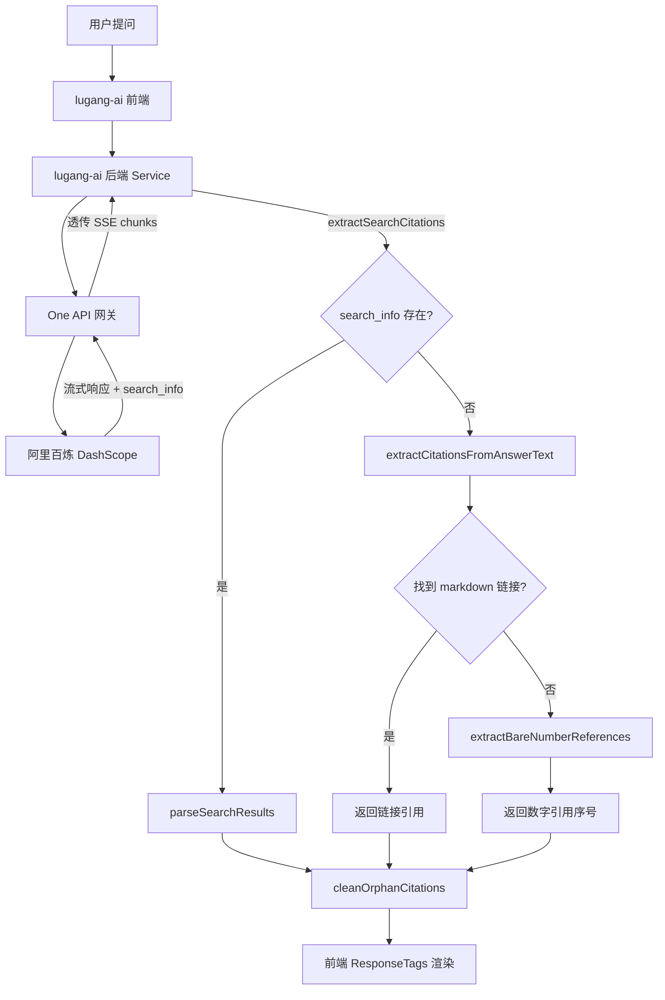

# Design Document: 联网搜索引用修复

## Overview

鲁港通平台使用阿里百炼（DashScope）模型进行联网搜索。当前问题是：AI 回答中包含 `[1]`、`[2]` 等引用序号，但底部引用区域无法显示对应的网页链接。

根本原因分析：
1. Qwen3.5 系列模型使用 OpenAI 兼容模式（`/compatible-mode/v1/chat/completions`），流式响应中 `search_info` 的传递路径与 DashScope 原生协议不同
2. 在兼容模式下，阿里百炼会在流式响应的某个 chunk 中返回 `search_info` 字段（顶层），One API 的 `openai.StreamHandler` 已经能透传这些 chunk
3. 前端 `extractSearchCitations` 已经检查了 `response.search_info`、`choices[0].delta.search_info`、`choices[0].message.search_info` 三个位置
4. 但实际问题可能是：兼容模式流式响应中 `search_info` 到达的时机或格式与预期不符，或者 OpenAI SDK 的流式解析器在客户端侧丢弃了非标准字段

修复策略采用多层防御：
- 后端确保 `search_info` 在流式和非流式模式下都能正确透传
- 前端增强 fallback 解析能力，从回答文本中提取裸数字引用 `[N]`
- 前端增加孤立引用序号清理，避免用户看到无法点击的引用标记

## Architecture



数据流经过 4 层：
1. 阿里百炼 → One API：DashScope 兼容模式返回 `search_info`
2. One API → lugang-ai Service：`openai.StreamHandler` 透传 SSE chunks
3. Service 层：`searchInfoParser.ts` 提取引用数据
4. 前端组件：`ResponseTags.tsx` 渲染引用列表

## Components and Interfaces

### 1. Citation_Parser（searchInfoParser.ts）

现有函数保持不变：
- `parseSearchResults(searchResults)` — 将 search_results 数组转为 WebSearchCitation[]
- `extractSearchCitations(response)` — 从响应对象提取 search_info
- `extractCitationsFromAnswerText(answerText)` — 从文本提取 markdown 链接

新增函数：

```typescript
/**
 * 从回答文本中提取裸数字引用序号 [1], [2], [3]
 * 返回引用序号数组（去重、排序）
 */
export function extractBareNumberReferences(text: string): number[]

/**
 * 清理回答文本中的孤立引用序号
 * - 有对应 citation 的 [N] 保留
 * - 无对应 citation 的 [N] 移除
 */
export function cleanOrphanCitations(
  text: string,
  citations: WebSearchCitation[]
): string
```

### 2. Request 层（request.ts）

现有逻辑已经在流式和非流式响应中调用 `extractSearchCitations` 和 `extractCitationsFromAnswerText`。需要增加：
- 在返回 `answerText` 前调用 `cleanOrphanCitations` 清理孤立引用

### 3. Citation_Renderer（ResponseTags.tsx）

现有渲染逻辑已支持 `webSearchCitations`。需要增加：
- 当回答文本中有 `[N]` 引用但无 citation 数据时，显示提示信息

### 4. One API 后端（openai/main.go）

`StreamHandler` 已经能透传包含 `search_info` 的 chunk（因为 `ChatCompletionsStreamResponse` 结构体已有 `SearchInfo` 字段）。需要验证：
- 空 choices + 有 search_info 的 chunk 不会被过滤掉（当前代码已处理此情况）

## Data Models

### WebSearchCitation（已存在）

```typescript
type WebSearchCitation = {
  index: number;
  title: string;
  url: string;
  icon?: string;
  siteName?: string;
};
```

### AliSearchInfo（后端，已存在）

```go
type AliSearchInfo struct {
  SearchResults []AliSearchResult `json:"search_results,omitempty"`
}

type AliSearchResult struct {
  Index    int    `json:"index"`
  Title    string `json:"title"`
  URL      string `json:"url"`
  Icon     string `json:"icon,omitempty"`
  SiteName string `json:"site_name,omitempty"`
}
```

### ChatCompletionsStreamResponse（后端，已存在）

```go
type ChatCompletionsStreamResponse struct {
  // ...existing fields...
  SearchInfo any `json:"search_info,omitempty"` // 透传 search_info
}
```

## Correctness Properties

*A property is a characteristic or behavior that should hold true across all valid executions of a system — essentially, a formal statement about what the system should do. Properties serve as the bridge between human-readable specifications and machine-verifiable correctness guarantees.*

### Property 1: Search results 解析完整性与去重

*For any* 有效的 search_results 数组（每个元素包含 url），`parseSearchResults` 返回的 WebSearchCitation 数组应满足：(a) 每个有 url 的元素都被包含，(b) 所有 URL 唯一，(c) index/title/url 字段正确映射。

**Validates: Requirements 1.1, 1.5**

### Property 2: Markdown 链接提取正确性

*For any* 包含 `[title](https://url)` 格式 markdown 链接的文本，`extractCitationsFromAnswerText` 应提取所有非图片、非知识库引用的 http/https 链接，且按 URL 去重。

**Validates: Requirements 1.3**

### Property 3: 裸数字引用提取

*For any* 包含 `[N]` 格式数字引用的文本（N 为正整数），`extractBareNumberReferences` 应返回所有出现的数字引用序号，去重且升序排列。

**Validates: Requirements 1.2, 1.4**

### Property 4: 孤立引用清理

*For any* 包含 `[N]` 数字引用的文本和任意 WebSearchCitation 数组，`cleanOrphanCitations` 应满足：(a) citation 中存在 index=N 的引用 → 文本中 `[N]` 保留，(b) citation 中不存在 index=N 的引用 → 文本中 `[N]` 被移除，(c) 非引用格式的文本内容不变。

**Validates: Requirements 4.1, 4.2, 4.3**

## Error Handling

| 场景 | 处理方式 |
|------|---------|
| search_info 字段格式异常 | `extractSearchCitations` 返回空数组，触发 fallback |
| search_results 中某项缺少 url | `parseSearchResults` 过滤掉该项 |
| 回答文本为空 | 所有解析函数返回空数组/空字符串 |
| markdown 链接格式不完整 | 正则不匹配，自动跳过 |
| 引用序号超出 citation 范围 | `cleanOrphanCitations` 移除该序号 |

## Testing Strategy

### 测试框架

- 单元测试：vitest
- 属性测试：fast-check（已安装在项目根目录 devDependencies）
- 配置：`vitest.simple.config.mts`
- 运行命令：`pnpm vitest run --config vitest.simple.config.mts`

### 属性测试

每个 Correctness Property 对应一个属性测试，最少 100 次迭代：

- **Property 1**: 生成随机 search_results 数组，验证 parseSearchResults 的输出完整性和去重
- **Property 2**: 生成包含随机 markdown 链接的文本，验证 extractCitationsFromAnswerText 的提取正确性
- **Property 3**: 生成包含随机 `[N]` 引用的文本，验证 extractBareNumberReferences 的提取和排序
- **Property 4**: 生成包含随机 `[N]` 引用的文本和随机 citation 数组，验证 cleanOrphanCitations 的选择性清理

每个属性测试用注释标注：
```
// Feature: web-search-citation-fix, Property N: {property_text}
```

### 单元测试

- 边界情况：空文本、空 search_results、单个引用、大量引用
- 特殊格式：图片链接 `` 不应被提取、知识库引用 `[hexId](CITE)` 不应被提取
- 混合场景：文本同时包含 markdown 链接和裸数字引用
