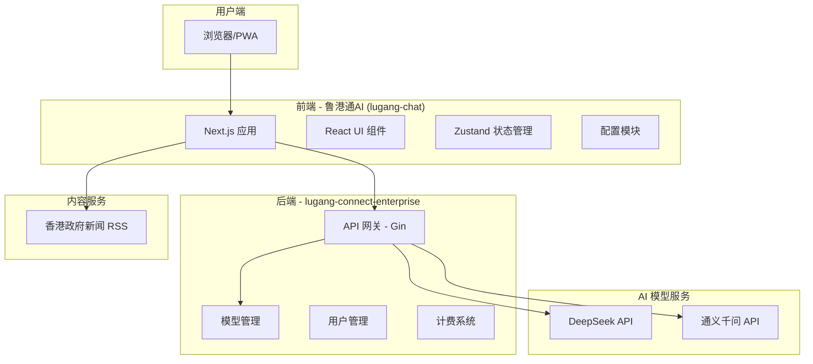
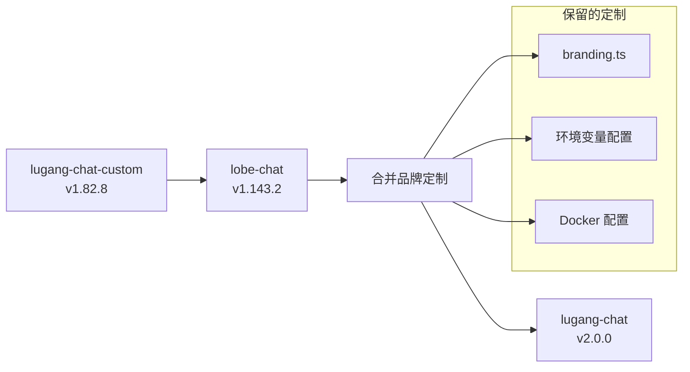

# Design Document: 鲁港通品牌定制化

## Overview

本设计文档描述了将 Lobe Chat 定制为"鲁港通跨境AI服务平台"的技术实现方案。主要工作包括：

1. **版本升级融合** - 从 1.82.8 升级到 1.143.2
2. **品牌定制化** - 移除所有第三方品牌，替换为鲁港通品牌
3. **模型限制** - 仅允许使用指定的中国境内模型
4. **功能定制** - 发现页面内容替换、移除不需要的功能入口
5. **性能优化** - 禁用远程资源拉取

## Architecture

### 系统架构图



### 版本升级策略



## Components and Interfaces

### 1. 品牌配置模块

**文件位置：** `packages/const/src/branding.ts`

```typescript
// 鲁港通品牌配置
export const LOBE_CHAT_CLOUD = '鲁港通云服务';
export const BRANDING_NAME = '鲁港通AI';
export const BRANDING_LOGO_URL = 'https://airscend.com/lugangconnect_logo.png';
export const ORG_NAME = '鲁港通';
export const COPYRIGHT = `© ${new Date().getFullYear()} 香港硕谷光核文化传播有限公司`;

export const BRANDING_URL = {
  help: 'http://156.225.30.134:8080/about',
  privacy: 'http://156.225.30.134:8080/privacy',
  terms: 'http://156.225.30.134:8080/terms',
};

export const SOCIAL_URL = {
  // 移除所有外部社交链接
  discord: undefined,
  github: undefined,
  medium: undefined,
  x: undefined,
  youtube: undefined,
};

export const BRANDING_EMAIL = {
  business: 'business@lugangconnect.com',
  support: 'support@lugangconnect.com',
};
```

### 2. 环境配置模块

**文件位置：** `src/envs/app.ts`

```typescript
// 禁用远程资源拉取
const ASSISTANT_INDEX_URL = ''; // 设为空禁用
const PLUGINS_INDEX_URL = ''; // 设为空禁用

// 或者指向本地服务
// const ASSISTANT_INDEX_URL = 'http://156.225.30.134:8080/api/agents';
// const PLUGINS_INDEX_URL = 'http://156.225.30.134:8080/api/plugins';
```

### 3. 模型提供商配置

**需要禁用的提供商：**
- OpenAI
- Azure OpenAI
- Anthropic
- Google AI
- AWS Bedrock
- Mistral
- Perplexity
- Groq
- 其他境外服务

**需要保留的提供商：**
- DeepSeek
- 阿里通义千问 (Qwen)

**配置方式：** 通过环境变量 `OPENAI_MODEL_LIST` 限制模型列表

```bash
OPENAI_MODEL_LIST="-all,+deepseek-chat=DeepSeek对话,+qwen-plus=通义千问Plus,+qwen-turbo=通义千问Turbo,+qwen-max=通义千问Max"
DEFAULT_AGENT_CONFIG="model=qwen-max"
```

### 4. 发现页面组件

**文件位置：** `src/app/[variants]/(main)/discover/`

需要重构发现页面，替换原有的助手市场/插件市场为新闻资讯：

```typescript
interface NewsItem {
  title: string;
  description: string;
  link: string;
  pubDate: string;
  category: 'economy' | 'education' | 'investment' | 'policy';
}

// RSS 数据源
const RSS_SOURCES = [
  'https://www.news.gov.hk/chi/rss/index.html',
  // 可扩展更多 RSS 源
];
```

### 5. 关于页面组件

**文件位置：** `src/app/[variants]/(main)/settings/about/`

移除所有外部链接（GitHub、Discord、Twitter 等），显示鲁港通品牌信息。

## Data Models

### 新闻资讯数据模型

```typescript
interface NewsArticle {
  id: string;
  title: string;
  description: string;
  content?: string;
  link: string;
  pubDate: Date;
  source: string;
  category: NewsCategory;
  thumbnail?: string;
}

type NewsCategory = 
  | 'economy'      // 经济贸易
  | 'education'    // 教育
  | 'investment'   // 投资
  | 'policy'       // 政策
  | 'culture';     // 文化交流
```

### 模型配置数据模型

```typescript
interface AllowedModel {
  id: string;
  displayName: string;
  provider: 'deepseek' | 'qwen';
  capabilities: {
    vision: boolean;
    functionCall: boolean;
  };
}

const ALLOWED_MODELS: AllowedModel[] = [
  { id: 'deepseek-chat', displayName: 'DeepSeek对话', provider: 'deepseek', capabilities: { vision: true, functionCall: true } },
  { id: 'qwen-plus', displayName: '通义千问Plus', provider: 'qwen', capabilities: { vision: false, functionCall: true } },
  { id: 'qwen-turbo', displayName: '通义千问Turbo', provider: 'qwen', capabilities: { vision: false, functionCall: true } },
  { id: 'qwen-max', displayName: '通义千问Max', provider: 'qwen', capabilities: { vision: true, functionCall: true } },
];
```

## Correctness Properties

*A property is a characteristic or behavior that should hold true across all valid executions of a system-essentially, a formal statement about what the system should do. Properties serve as the bridge between human-readable specifications and machine-verifiable correctness guarantees.*

### Property 1: 代码品牌清理验证

*For any* 源代码文件，搜索 "LobeChat"、"lobehub"、"OpenAI"（非 API 调用代码）字样应返回空结果。

**Validates: Requirements 2.4, 2.5, 12.1-12.5**

### Property 2: 模型列表过滤

*For any* 模型选择器组件渲染的模型列表，列表中的每个模型 ID 都应该属于允许的模型集合 {deepseek-chat, qwen-plus, qwen-turbo, qwen-max}。

**Validates: Requirements 1.1, 1.2, 1.3, 1.5**

### Property 3: 默认模型配置

*For any* 新创建的对话，其默认模型应该是 "qwen-max"（通义千问Max）。

**Validates: Requirements 1.4**

### Property 4: 远程资源禁用

*For any* 应用启动后的网络请求，不应包含对以下域名的请求：
- chat-agents.lobehub.com
- chat-plugins.lobehub.com
- registry.npmmirror.com/@lobehub/*

**Validates: Requirements 7.1, 7.2, 7.3, 7.4, 7.5**

## Error Handling

### 1. RSS 获取失败

当香港政府新闻 RSS 获取失败时：
- 显示缓存的历史新闻
- 显示友好的错误提示
- 自动重试机制（指数退避）

### 2. 模型 API 调用失败

当 DeepSeek/通义千问 API 调用失败时：
- 显示具体错误信息（非技术性描述）
- 提供重试选项
- 记录错误日志

### 3. 版本升级兼容性问题

如果升级后出现兼容性问题：
- 保留回滚方案
- 记录详细的升级日志
- 提供手动修复指南

## Testing Strategy

### 单元测试

- 测试品牌配置模块的正确性
- 测试模型过滤逻辑
- 测试 RSS 解析功能

### 集成测试

- 测试前端与后端 API 的集成
- 测试模型调用流程
- 测试发现页面内容加载

### 端到端测试

- 测试完整的用户流程
- 测试品牌元素的正确显示
- 测试性能指标

### 静态代码分析

- 使用 grep 搜索验证品牌清理
- 检查是否有遗漏的第三方品牌引用

```bash
# 验证品牌清理
grep -r "LobeChat" src/ --include="*.ts" --include="*.tsx"
grep -r "lobehub" src/ --include="*.ts" --include="*.tsx"
grep -r "OpenAI" src/ --include="*.ts" --include="*.tsx" | grep -v "// API"
```

## Implementation Notes

### 版本升级步骤

1. **备份当前版本**
   ```bash
   cp -r lugang-chat-custom lugang-chat-custom-backup
   ```

2. **复制新版本**
   ```bash
   cp -r lobe-chat-1.143.2 lugang-chat-v2
   ```

3. **合并品牌定制**
   - 复制 `branding.ts` 配置
   - 更新 `package.json` 信息
   - 更新环境变量配置

4. **移除第三方品牌**
   - 批量替换 "LobeChat" → "鲁港通AI"
   - 移除外部链接
   - 更新 Logo 和 favicon

5. **测试验证**
   - 运行单元测试
   - 手动测试关键功能
   - 验证品牌显示

6. **构建 Docker 镜像**
   ```bash
   docker build -t lugang-chat:v2 .
   ```

### 需要修改的关键文件

| 文件路径 | 修改内容 |
|---------|---------|
| `packages/const/src/branding.ts` | 品牌名称、Logo、联系方式 |
| `src/envs/app.ts` | 禁用远程资源 URL |
| `src/config/modelProviders/` | 禁用境外模型提供商 |
| `src/app/.../settings/about/` | 移除外部链接 |
| `src/app/.../discover/` | 替换为新闻资讯 |
| `public/` | 替换 favicon 和 Logo |
| `locales/zh-CN/` | 更新中文翻译 |
| `package.json` | 更新项目名称和描述 |
| `docker-compose.yml` | 更新环境变量 |
