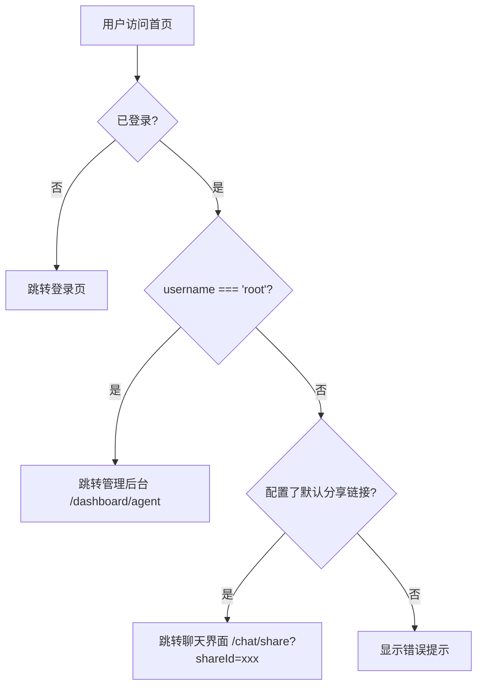

# Design Document

## Overview

本设计文档描述鲁港通用户体验重构的技术实现方案。主要包括：用户角色路由、普通用户聊天界面、用户设置面板、知识库权限控制、前后端用户同步等功能模块。

## Architecture

### 系统架构

```
┌─────────────────────────────────────────────────────────────┐
│                    用户浏览器                                │
└─────────────────────────────────────────────────────────────┘
                              │
                              ▼
┌─────────────────────────────────────────────────────────────┐
│              鲁港通前端 (www.airscend.com)                   │
│  ┌─────────────┐  ┌─────────────┐  ┌─────────────────────┐  │
│  │  登录/注册   │  │  聊天界面   │  │   用户设置面板      │  │
│  └─────────────┘  └─────────────┘  └─────────────────────┘  │
│  ┌─────────────┐  ┌─────────────┐  ┌─────────────────────┐  │
│  │  管理后台   │  │  权限控制   │  │   内容管理          │  │
│  └─────────────┘  └─────────────┘  └─────────────────────┘  │
└─────────────────────────────────────────────────────────────┘
                              │
              ┌───────────────┼───────────────┐
              ▼               ▼               ▼
┌─────────────────┐  ┌─────────────┐  ┌─────────────────────┐
│   MongoDB       │  │   MinIO     │  │  鲁港通后端         │
│   (用户/聊天)   │  │   (文件)    │  │  (api.airscend.com) │
└─────────────────┘  └─────────────┘  └─────────────────────┘
```

### 用户角色判断流程



## Components and Interfaces

### 1. 用户角色路由组件

**文件**: `src/pages/index.tsx`

```typescript
interface UserInfo {
  username: string;
  team?: {
    role: string;
  };
}

// 判断是否为管理员
const isAdmin = (userInfo: UserInfo): boolean => {
  return userInfo.username === 'root';
};
```

### 2. 用户设置面板组件

**文件**: `src/components/UserSettingsPanel/index.tsx`

```typescript
interface SettingsMenuItem {
  key: string;
  icon: React.ReactNode;
  label: string;
  onClick: () => void;
}

interface UserSettingsPanelProps {
  isOpen: boolean;
  onClose: () => void;
  userInfo: UserInfo;
}
```

**菜单项配置**:
- activityCenter: 活動中心
- language: 語言
- changePassword: 修改密碼
- feedback: 產品反饋
- accessibility: 輔助使用設計
- termsOfUse: 使用條款
- privacyPolicy: 隱私政策
- dataCollection: 個人資料收集聲明
- logout: 登出

### 3. 知识库引用显示组件

**文件**: `src/components/ChatCitation/index.tsx`

```typescript
interface Citation {
  type: 'url' | 'file';
  source: string;
  content?: string;
  fileId?: string;
}

interface ChatCitationProps {
  citations: Citation[];
  isAdmin: boolean;
}
```

### 4. 内容管理 API

**管理员可配置内容**:

```typescript
interface SystemContent {
  key: 'terms_of_use' | 'privacy_policy' | 'data_collection';
  content: string;
  updatedAt: Date;
}

interface Activity {
  id: string;
  title: string;
  description: string;
  imageUrl?: string;
  linkUrl?: string;
  startDate: Date;
  endDate: Date;
  isActive: boolean;
}
```

### 5. 用户同步服务

**文件**: `src/service/integration/userSync.ts`

```typescript
interface UserSyncData {
  username: string;
  email: string;
  phone?: string;
  displayName: string;
  password?: string;
}

// 同步用户到后端
async function syncUserToBackend(data: UserSyncData): Promise<void>;

// 从后端获取用户信息
async function getUserFromBackend(username: string): Promise<BackendUser>;
```

## Data Models

### 1. 系统内容模型 (MongoDB)

```typescript
// 系统内容 Schema
const SystemContentSchema = new Schema({
  key: { 
    type: String, 
    required: true, 
    unique: true,
    enum: ['terms_of_use', 'privacy_policy', 'data_collection']
  },
  content: { type: String, required: true },
  updatedAt: { type: Date, default: Date.now },
  updatedBy: { type: Schema.Types.ObjectId, ref: 'User' }
});
```

### 2. 活动模型 (MongoDB)

```typescript
// 活动 Schema
const ActivitySchema = new Schema({
  title: { type: String, required: true },
  description: { type: String },
  imageUrl: { type: String },
  linkUrl: { type: String },
  startDate: { type: Date, required: true },
  endDate: { type: Date, required: true },
  isActive: { type: Boolean, default: true },
  createdAt: { type: Date, default: Date.now },
  createdBy: { type: Schema.Types.ObjectId, ref: 'User' }
});
```

### 3. 用户扩展字段 (MongoDB)

```typescript
// 扩展用户 Schema
const UserExtensionSchema = new Schema({
  userId: { type: Schema.Types.ObjectId, ref: 'User', required: true },
  phone: { type: String },
  birthDate: { type: Date },
  address: { type: String },
  googleAccount: { type: String },
  languagePreference: { type: String, default: 'zh-CN' }
});
```


## Correctness Properties

*A property is a characteristic or behavior that should hold true across all valid executions of a system—essentially, a formal statement about what the system should do. Properties serve as the bridge between human-readable specifications and machine-verifiable correctness guarantees.*

### Property 1: User Role Routing

*For any* user with username, if username equals 'root', the system should redirect to '/dashboard/agent'; otherwise, if a default share link is configured, the system should redirect to '/chat/share?shareId={shareId}'.

**Validates: Requirements 1.1, 1.2, 1.3**

### Property 2: Citation Permission Filtering

*For any* chat response with citations, if the user is not an admin (username !== 'root'), the displayed citations should only contain items where type equals 'url'; file-type citations should be filtered out.

**Validates: Requirements 4.2, 4.3, 4.4**

### Property 3: Password Validation Rules

*For any* password string, the password is valid if and only if it contains at least one uppercase letter, at least one lowercase letter, at least one digit, and has length between 8 and 20 characters inclusive.

**Validates: Requirements 3.3.3, 8.2**

### Property 4: User Sync Data Integrity

*For any* user registration, if the registration succeeds in the frontend, the backend should contain a user record with matching username and email within a reasonable sync window.

**Validates: Requirements 5.1, 5.2**

### Property 5: User Profile Validation

*For any* user profile update, the email field must match a valid email format regex, and the phone field (if provided) must match Chinese mobile number format (starting with 1, followed by 10 digits).

**Validates: Requirements 6.3, 6.4**

### Property 6: Activity Date Filtering

*For any* activity list query, the returned activities should only include items where current date is between startDate and endDate, and isActive is true.

**Validates: Requirements 3.1.4**

### Property 7: Language Preference Persistence

*For any* language selection, after a user selects a language and refreshes the page, the interface should display in the previously selected language.

**Validates: Requirements 3.2.3, 3.2.4**

## Error Handling

### 1. 用户同步失败

- 同步失败不阻塞用户操作
- 记录错误日志，后台可查看
- 定期重试机制（可选）

### 2. 分享链接未配置

- 显示友好错误提示
- 提供联系管理员的方式

### 3. 密码修改失败

- 显示具体错误原因
- 当前密码错误 / 新密码不符合规则 / 网络错误

### 4. 内容加载失败

- 显示默认占位内容
- 提供重试按钮

## Testing Strategy

### Unit Tests

- 用户角色判断函数
- 密码验证函数
- 邮箱/手机号格式验证
- 引用过滤函数

### Property-Based Tests

使用 fast-check 库进行属性测试：

1. **User Role Routing**: 生成随机用户名，验证路由逻辑
2. **Citation Filtering**: 生成随机引用列表，验证过滤结果
3. **Password Validation**: 生成随机字符串，验证密码规则
4. **Profile Validation**: 生成随机邮箱/手机号，验证格式检查

### Integration Tests

- 用户注册 → 后端同步流程
- 登录 → 角色路由流程
- 设置面板各功能点击测试

### Configuration

- 每个属性测试运行最少 100 次迭代
- 测试标签格式: **Feature: user-experience-redesign, Property {number}: {property_text}**

